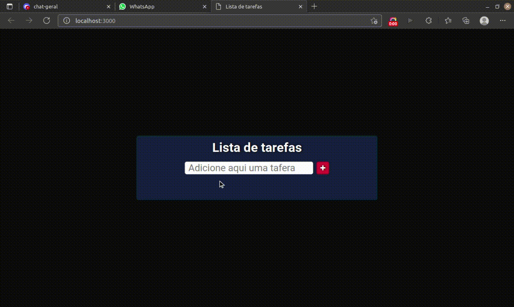

 <h1 align="center"><strong>Todo List</strong></h1>

<br>
<p align="center">
  <a href="#-project">Project</a>&nbsp;&nbsp;&nbsp;|&nbsp;&nbsp;&nbsp;
  <a href="#installation">Installation</a>&nbsp;&nbsp;&nbsp;|&nbsp;&nbsp;&nbsp;
  <a href="#-technologies">Technologies</a>
</p>

<br>

### This is a project that i practice my knowledge of Front-End, in special the ReactJs.

<br>

## 💻 Project


<p>This application is to help with your tasks.</p>

<br>

<br>
<br>


## Installation

- Important: You must have installed the Node.js and Git

```bash
# clone it
$ git clone https://github.com/Wesley-AlvesRolim/React-Fundamentals.git

$ cd React-Fundamentals/

# Install dependencies
$ npm install

# Running scripts
$ npm start
```


## 🚀 Technologies

This project was developed using the following technologies:

-  **React**